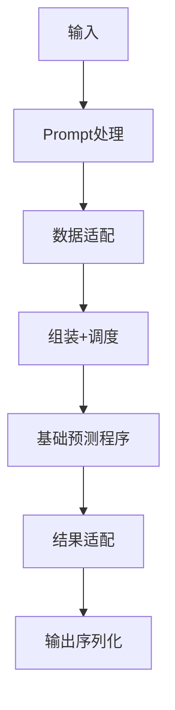

# Program 模块技术文档

## 概述

Program 模块作为系统的高级处理单元，通常代表一个完整的 llm 应用程序，负责管理 llm 程序的输入输出及处理流程。

## 目录结构

```no
program/
├── adapter.go        // 适配器接口及实现，包含 llm 输入输出数据格式转换
├── completion.go     // TODO
├── cot.go            // 链式思维（Chain of Thought）应用程序逻辑实现
├── pipline.go        // Pipeline Like 应用程序逻辑实现
├── predictor.go      // 预测器实现，为底层的 llm 应用程序统一实现
├── program.go        // 模块入口，包含通用的抽象、结构定义
├── prompt.go         // Prompt 处理逻辑
└── raw_adapter.go    // 原始数据适配器
```

### 主要文件功能

- **adapter.go**
  - 定义适配器接口 `Adapter`
  - 实现 JSON 适配器 `JSONAdapter`
  - 实现 RAW 适配器 `RawAdapter`
- **completion.go**
  - TODO
- **cot.go**
  - 实现链式思维推理
  - 支持多步推理
  - 提供推理过程可视化
- **pipline.go**
  - 实现管道式应用程序逻辑
  - 顺序逻辑
- **predictor.go**
  - 实现基础程序逻辑
  - 支持多种模型
  - 协调模块间通信
- **program.go**
  - 主模块入口
  - 初始化各模块
- **prompt.go**
  - 处理用户输入、输出
  - 维护基础提示

### 代码逻辑

核心流程：



## 关键接口

**// 适配器接口**

```go
type Adapter interface {
    Format(*predictor, map[string]any, any) ([]llm.Message, error)
    Parse(string, any) error
}
```

**// 应用程序接口**

```go
type Program interface {
    Prompt() *Promptx
    Update(...option)
    Forward(context.Context, map[string]any) (any, error)
}
```

**// 基础程序定义**

```go
type predictor struct {
}
```

## 依赖关系

- 依赖 llm 模块提供语言模型支持
- 依赖 prompt 模块处理提示工程
- 依赖 tool 模块提供工具支持

## 配置说明

TODO

## 使用示例

### 基本使用

```go
// 初始化程序
p := program.New(
    program.WithAdapter("json"),
)

// 处理输入
input := `{"question": "什么是人工智能？"}`
output, err := p.Forward(context.Background(), input)
if err!= nil {
    log.Fatal(err)
}

// 输出结果
fmt.Println(output)
```

### 链式调用

```go
// 定义结果
var target any

// 定义调用链，并调用
err := program.COT().
    WithInstruction("hello？").
    WithInputField("hello", "world").
    WithOutputField("hello", "world").
    Result(context.Background(), &target)
if err != nil {
    panic(err)
}
// 输出结果
fmt.Println(target)
```
