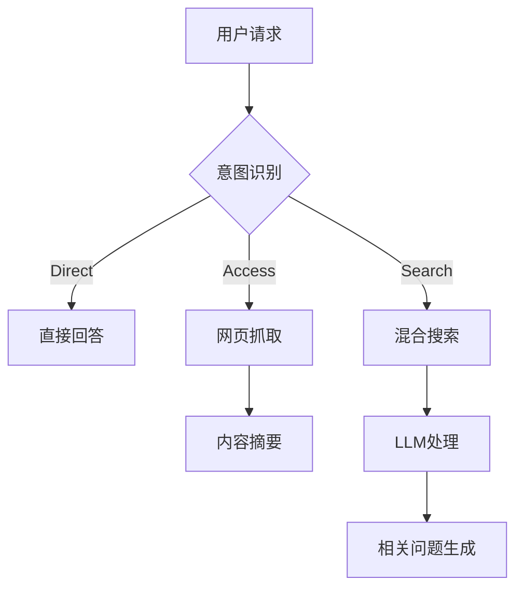

# 智能搜索代理系统文档

## 概述
本系统是基于LLM的智能搜索解决方案，提供以下核心能力：
- 意图识别与查询改写
- 多源信息检索（网页/API/知识库）
- 实时流式响应（SSE）
- 自动化结果摘要

## 快速开始
```bash
# 设置环境变量
export SERPER_API_KEY=your_serper_key
export QWEN_API_KEY=your_qwen_key

# 启动服务
go run example/search-agent/main.go
```

## 系统架构


## 核心模块

### 1. 意图识别引擎 ([define.go#L10](example/search-agent/workflow/define.go#L10))

- 使用千问Plus模型进行意图分类
- 支持三种决策类型：

```go
var intentNode = workflow.Node{
    Metadata: map[string]any{
        "user_prompt": `意图判断逻辑...`
    }
}
```

### 2. 工作流引擎 ([define.go#L52](example/search-agent/workflow/define.go#L52))

```go
func BuildWorkflow() *workflow.Workflow {
    // 构建包含三个分支的工作流
    wf.LinkWithCondition("gateway", `decision=="direct"`, ...)
    wf.LinkWithCondition("gateway", `decision=="access"`, ...) 
    wf.LinkWithCondition("gateway", `decision=="search"`, ...)
}
```

### 3. 搜索处理流程
1. **网页抓取分支**：
   - 使用Jina Reader抓取网页内容
   - 千问模型进行内容摘要

2. **混合搜索分支**：
   - 调用Serper API进行网络搜索
   - 结果经过LLM加工处理
   - 自动生成相关问题

## 代码结构

[代码库](https://github.com/showntop/llmack/tree/main/example/search-agent)

```bash
example/search-agent/
├── main.go            # 服务入口与配置
├── workflow/
│   └── define.go      # 工作流定义 
└── inter/
    └── sse_handler.go # SSE接口实现
```

## API接口
`POST /api/search`
```json
{
  "query": "如何制作AI绘本",
  "stream": true 
}
```

响应示例（SSE格式）：
```
data: {"content": "制作AI绘本的步骤..."}
```

## 配置说明
| 环境变量 | 必需 | 说明 |
|---------|------|-----|
| SERPER_API_KEY | 是 | Serper搜索API密钥 |
| QWEN_API_KEY | 是 | 千问模型API密钥 |

## 典型用例
1. **简单问答**  
   `你是谁？` → 直接回答

2. **网页解析**  
   `请总结https://example.com内容` → 抓取+摘要

3. **复杂搜索**  
   `如何用Stable Diffusion生成图片` → 混合搜索+LLM处理